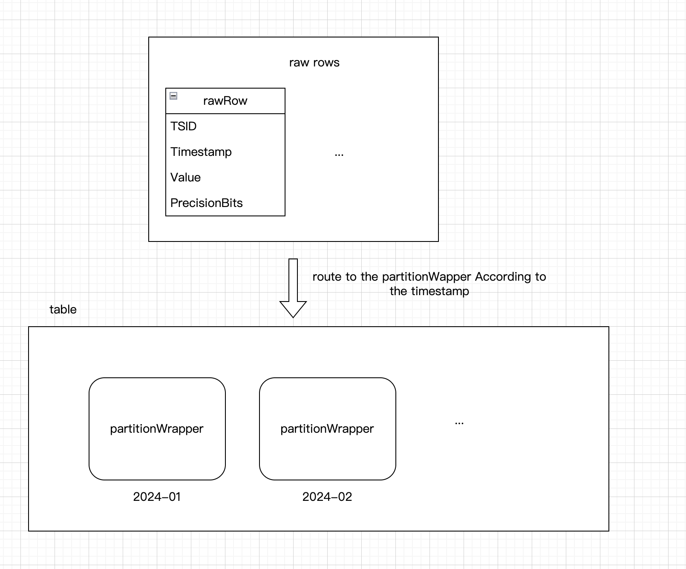

# VictoriaMetrics 设计
## 1. 背景

VictoriaMetrics(简称vm)的内部设计文档过于稀少，为了方便日后的维护和问题排查，尝试从源码分析其每个组件的核心功能

## 2. 组件

### 2.1 vmagent

[vmagent fastqueue design](./vmagent-fastqueue.md)

### 2.2 vmselect

https://github.com/VictoriaMetrics/VictoriaMetrics/issues/3268

https://blog.devops.dev/persistent-data-structures-in-victoriametrics-part-2-vmselect-9e3de39a4d20

### 2.3 vmstorage

[how-mergeset-works-in-victoriametrics](https://stackoverflow.com/questions/78325903/how-mergeset-works-in-victoriametrics)

### partition



source code
```go
// file path:/lib/storage/table.go
func (tb *table) MustAddRows(rows []rawRow) 
```

VictoriaMetrics的存储引擎是基于分区的，每个分区包含多个块，每个块包含多个行，每个行包含多个时间序列。
partition主要是按月划分。在small part path和big part path里面分别有记录。

VictoriaMetrics's storage engine is based on partitions, each partition contains multiple blocks, each block contains multiple rows, each row contains multiple time series.
The partition is mainly divided by month. There are records in the small part path and the big part path respectively.

```shell

```go
// mustCreatePartition creates new partition for the given timestamp and the given paths
// to small and big partitions.
func mustCreatePartition(timestamp int64, smallPartitionsPath, bigPartitionsPath string, s *Storage) *partition {
	// the name of the partition is the timestamp which is the start of the month,eg 2024-09
    name := timestampToPartitionName(timestamp)
    smallPartsPath := filepath.Join(filepath.Clean(smallPartitionsPath), name)
    bigPartsPath := filepath.Join(filepath.Clean(bigPartitionsPath), name)
    logger.Infof("creating a partition %q with smallPartsPath=%q, bigPartsPath=%q", name, smallPartsPath, bigPartsPath)
    
    fs.MustMkdirFailIfExist(smallPartsPath)
    fs.MustMkdirFailIfExist(bigPartsPath)
    
    pt := newPartition(name, smallPartsPath, bigPartsPath, s)
    pt.tr.fromPartitionTimestamp(timestamp)
    pt.startBackgroundWorkers()
    
    logger.Infof("partition %q has been created", name)
    
    return pt
}
```

### rawRowsShards

patition contains the rawRowsShards, which is the raw data before compressing. The raw data is stored in the rawRowsShards, and the data is converted into inmemoryParts on every pendingRowsFlushInterval or when rawRows becomes full.

partition--> rawRowsShards --> inmemoryParts

source code
```go
// lib/storage/partition.go
func (rrss *rawRowsShards) addRows(pt *partition, rows []rawRow) {
    shards := rrss.shards
    shardsLen := uint32(len(shards))
    for len(rows) > 0 {
        n := rrss.shardIdx.Add(1)
        idx := n % shardsLen
        tailRows, rowsToFlush := shards[idx].addRows(rows)
        rrss.addRowsToFlush(pt, rowsToFlush)
        rows = tailRows
    }
}
```

```go
// rawRows contains recently added rows that haven't been converted into parts yet.
//
// rawRows are converted into inmemoryParts on every pendingRowsFlushInterval or when rawRows becomes full.
//
// rawRows aren't visible for search due to performance reasons.
rawRows rawRowsShards
```


有兴趣了解这个实现可以参考这个MR [merge request](https://kgit.kugou.net/yongquanli/VictoriaMetrics/-/tree/rrs_implement)

生成partition后的内存压缩逻辑 [compression](https://segmentfault.com/a/1190000043749609)

代码路径：

```shell
raw_row.go#marshalToInmemoryPart
```

uint64的压缩手段，跟leveldb的实现方式一样，每个byte的最高位用来表示这个整数的开头的第一个byte。
所以一个byte的有效存储为7个bit，对于uint64这样8个byte的整数，最多需要5个byte来存储。
```go
// MarshalVarUint64 appends marshaled u to dst and returns the result.
func MarshalVarUint64(dst []byte, u uint64) []byte {
if u < (1 << 7) {
return append(dst, byte(u))
}
if u < (1 << (2 * 7)) {
return append(dst, byte(u|0x80), byte(u>>7))
}
if u < (1 << (3 * 7)) {
return append(dst, byte(u|0x80), byte((u>>7)|0x80), byte(u>>(2*7)))
}

// Slow path for big integers.
var tmp [1]uint64
tmp[0] = u
return MarshalVarUint64s(dst, tmp[:])
}
```

- 压缩

压缩的逻辑稍显复杂，但是核心有几个点

- 相同的指标（TSID）放在同一个block里面(block header)会维护这个信息
- block内根据timestamp进行排序
- values值和timestamp分别存储在两个array里面，这样方便对相邻的值进行压缩
- 有一个思路是相邻的值的差异不会太大（指标数据的特点），一般是上下浮动。因此可以考虑计算相邻两值的diff值进行存储
- 我们只存储diff值，diff值考虑用变长整形来存储（eg. varUnit64），可以大大减少存储空间
- block header本质上也是个索引，保存了每个block的最早的timestamp和最晚的timestamp方便进行检索


### 2.4 vminsert

## reference

[understanding false sharing](https://theboreddev.com/understanding-false-sharing/)


