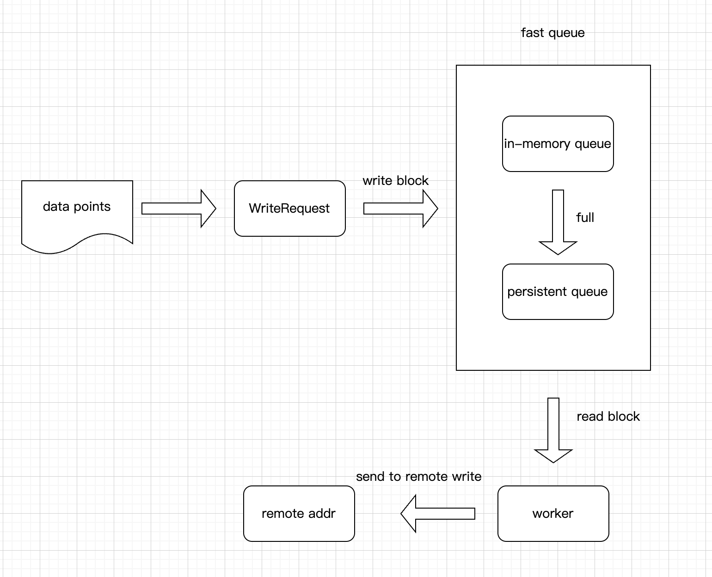

# vmagent fast queue design

## Introduction

vmagent fast queue is the key component of vmagent, which is used to store the data points received from the Prometheus remote write API. The fast queue is designed to be a high-performance, low-latency, and high-throughput queue that can handle a large number of data points with minimal resource consumption.

## Design Goals

The design of the fast queue is driven by the following goals:

- High performance: The fast queue should be able to handle a large number of data points with minimal latency and resource consumption.
- Low latency: The fast queue should be able to process data points quickly and efficiently, without introducing any significant delays.
- High throughput: The fast queue should be able to process a large number of data points per second, without any bottlenecks.
- Persistence: The fast queue should be able to persist data points to disk in case of a system failure or restart.

## Design Overview

### key component

- WriteRequest

gather the metrics in memory, if the memory is full or ttl reach, then flush the metrics to the fast queue.

- in-memory queue

fast queue contain two queue, in-memory queue and persistent queue. For most cases, the in-memory queue is enough to handle the data points.

- persistent queue

If the in-memory queue is full, the data points will be flushed to the persistent queue. The persistent queue is used to store the data points that cannot be processed immediately.

